# cudalibrary
Mini Pytorch style neural network library made entirely in C++ and CUDA.

WARNING: This project is not completely finished, (I am sorry) but it should be done by 8/23/2026, 4 days from when I'm writing this.

Explanation of neural networks:

Neural networks are simply just functions (meaning you give them an input and they give back an output). However, they are special, because you have to mold the function (network) itself to your liking through training.

The function starts out as trash, and we gradually mold it so that it gives the correct output we want for each input we give it. It’s kind of a strange process. The reason we can’t just mathematically figure out the formula for the function that we want is that neural networks are very complex, with many calculations occurring across many layers. The correct function is far too complex to figure out manually. 

What we can do instead is try an input, see how off the output that our network spits out is, and use simple formulas to make it less wrong. Once it becomes “less wrong” enough, it may even seem like it’s right! However, it is almost impossible to come up with a neural network that gives the completely correct output 100% of the time unless the example is very simple. 

For example, the neural network can be used to represent the equation y = x^2 could potentially be correct 100% percent of the time, but this is a simple, trivial example that can be expressed deterministically anyway (meaning that the output is guaranteed to be the same every time given a certain input), so there is no reason to even represent this function with a neural network in this case.

The actual strength of a network can be seen in more subtle problems. For example, reading in any image of a cat or dog, and being able to say which animal it is. It is literally impossible to make a deterministic mathematical function that can compute this, as you can’t possibly capture the scope of all possible input images manually (every breed, every position the animal may be in, every weird expression on its face, etc.). There are potentially infinite possible images of cats and dogs. Therefore, we must use a neural network that can pick up on common patterns in order to achieve the function that we want.

Here is a simple overview of the math for how we test a certain input in our neural network and see how wrong the output is. This is the neural network itself. This is a very small model, with an input layer of dimension 3, one hidden layer of dimension 2, and an output layer of dimension 1.

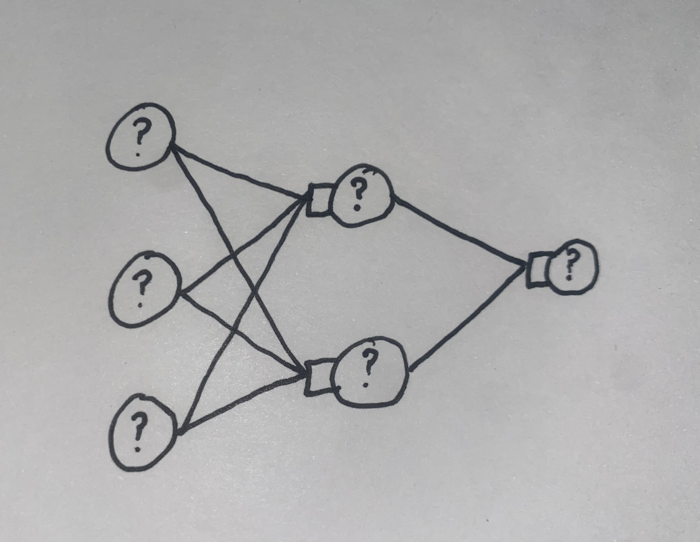

Here is a closer look at one part of the model. The model itself is really just its weights and biases. The activations are the output we see after testing an input by running it through the model. Activations may also be called nodes or neurons. We must compute these layer by layer until we compute the output layer, in a process called forward propagation. Note: I haven’t included the numbers of the weights and biases in the image above for the sake of simplicity, but they exist.

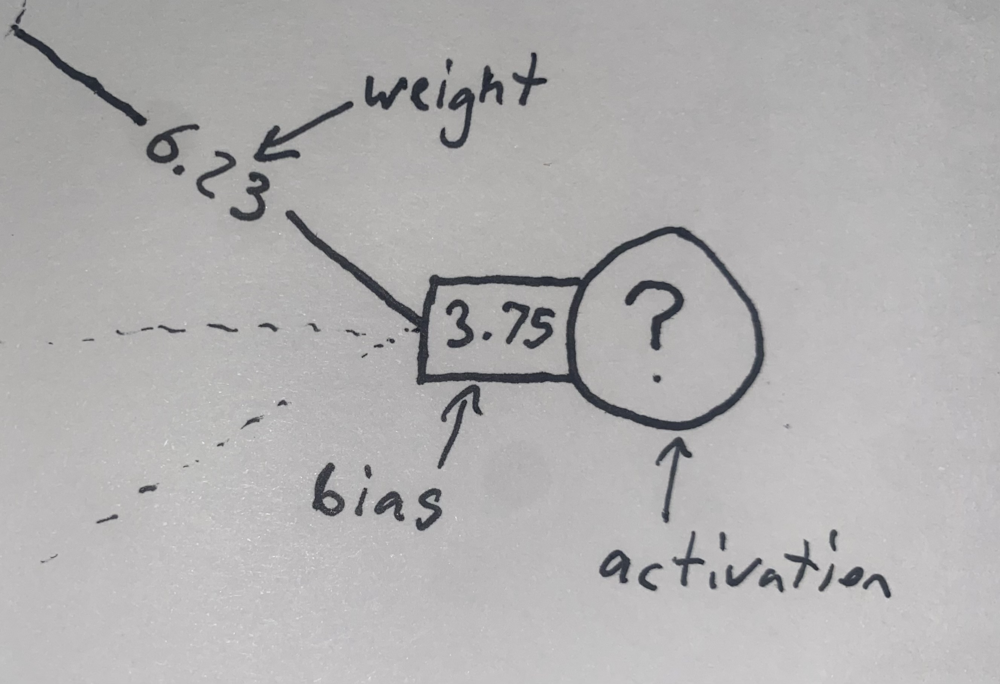

Lets say we only care about 2 inputs for this model. These must match up size wise with our model (input of size 3 and expected output of size 1). So we want our network to output 1.00 in the final activation node when our inputs are all 1.00, and output 0.00 when our inputs are all 0.00. In other cases, like if we set all inputs to .50, we will get some random output since we aren’t training our model in terms of the .50 input, and we don’t care.

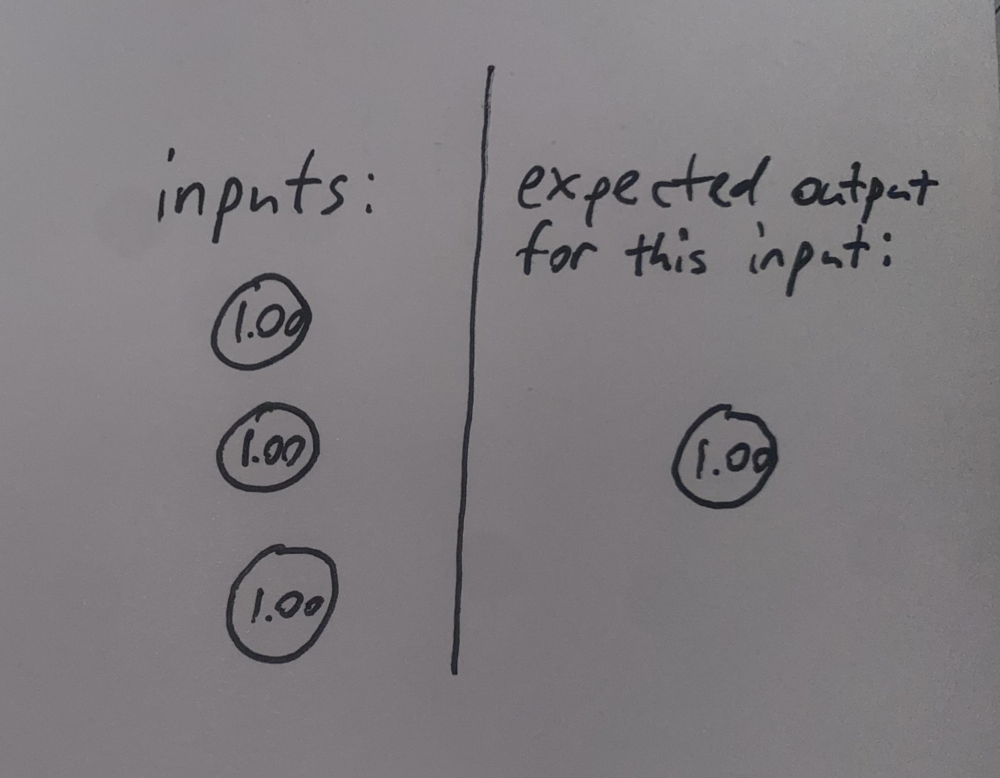

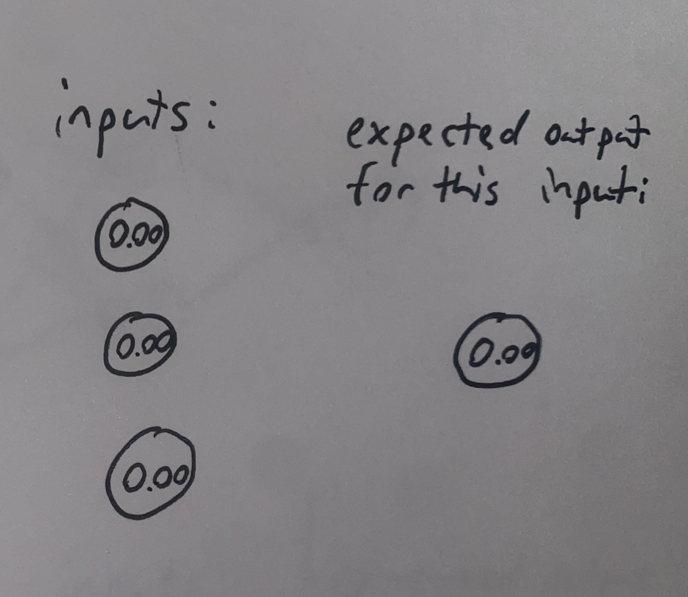

So, we plug in the 1.00 input in to see how bad our output is at this point, then we correct from there.

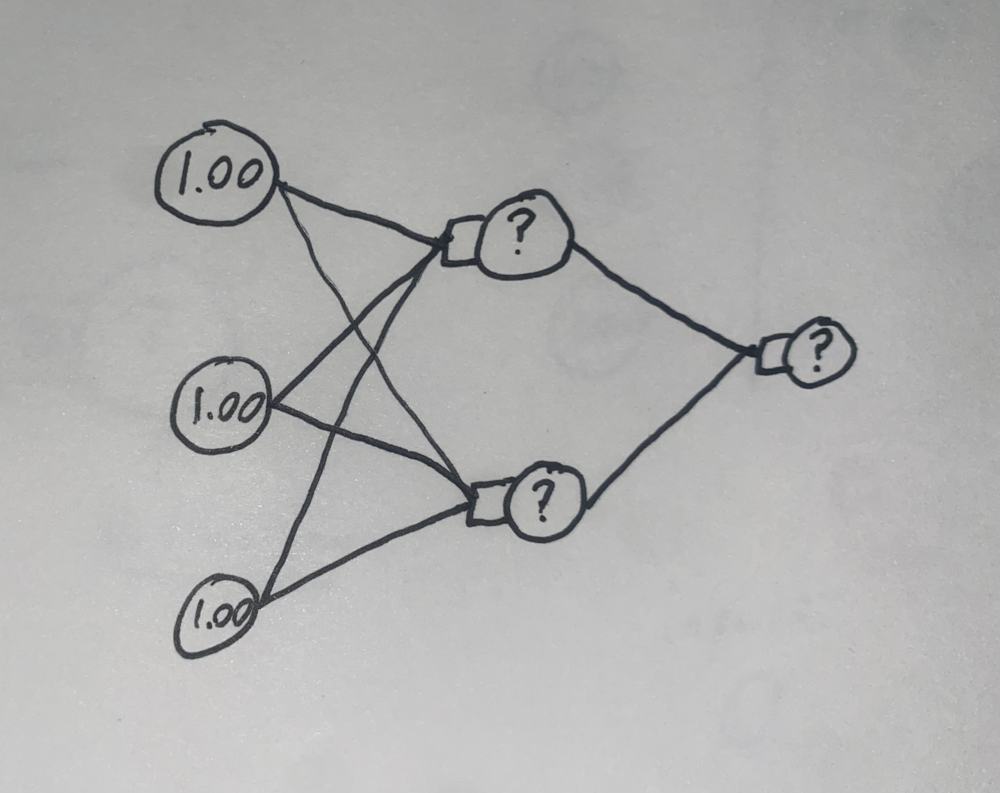

Let’s forward propagate one layer (I’ll show the math on how we do this in the next layer).

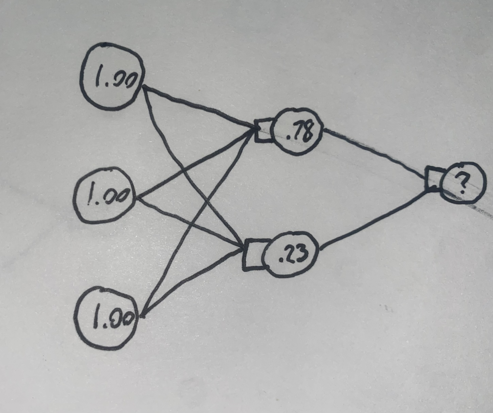

So we’ve calculated our activations for the middle layer! Now we just have to calculate the activation of the final node for the given input. Let's look closer at what the two weights and one bias are. We will use those for the calculation. So (seen below as well):
	
	First weight 1 = .65
	Second weight = -.42
	Bias for final node = .10

Once we propagate on this layer, we get .51, which is then passed through the sigmoid function (denoted by σ) in order to control the output, and keep it between 0 and 1.

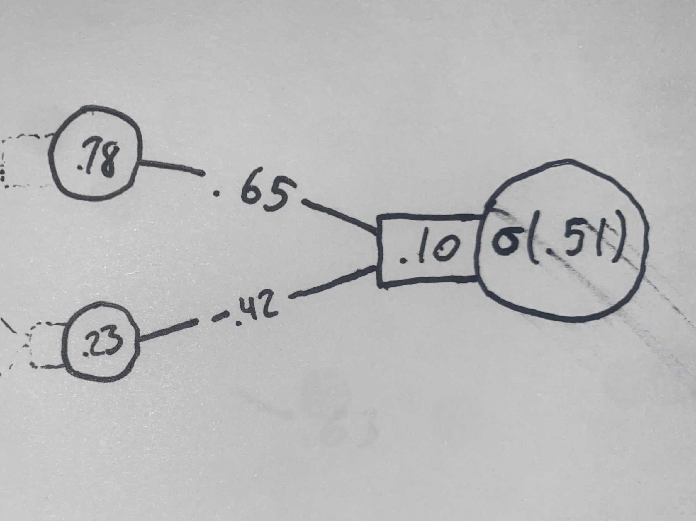

Sigmoid function σ (so activations don’t move toward infinity):

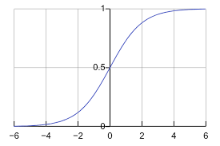

Here is the matrix representation of this calculation. We add the bias after multiplying the weight and activation matrices.

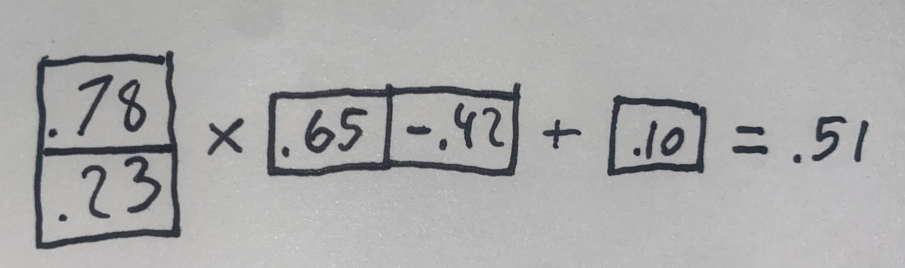

Here are the actual equations for the matrix multiplication and addition. These are very simple

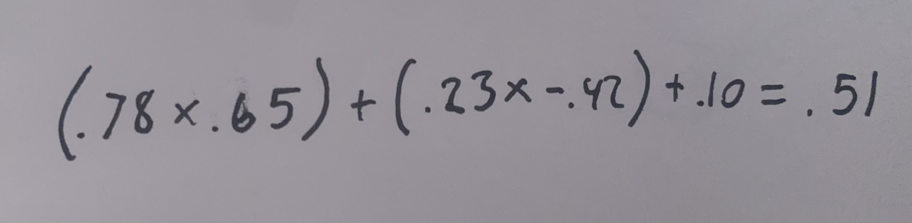

Final network output:
σ(.51) = .62

Shoot! We wanted the output to be 1.00, but it’s .62. We are .38 off. Now, we have to backpropagate through the network, slightly nudging the weights and biases so that on the next run we get a little bit closer to our desired output. We should also train on the 0.00 input so that we don’t only update our model to get better on the 1.00 input.

To test how wrong we are, we calculate the cost using our desired value and our actual value with the “cost function”. The most common cost function to use is MSE (mean squared error).

MSE = (actual value - desired value)²

With our numbers: (.62 - 1.00)² = .14

Squaring here is convenient because if there’s a big difference between the actual and desired values, meaning that the model is really bad, the MSE will be much higher. If there’s only a small difference between the actual and desired values, we will only gently nudge the model toward the right solution. Squaring also guarantees our output will be positive. We don’t actually care about the value of the cost function output, we only care about how it tells us to make the model better (so we only care about its derivative, I’ll explain in a second). 

The goal of backpropagation is to find the minimum of the cost function. This is equivalent to saying we want to find the point where the graph dips lowest, and equivalent to saying that we want to find the point where the slope of the graph is flat, meaning we are either at a local or global minima. Training is similar to a ball rolling down a hill, trying to get the lowest it possibly can to minimize cost (minimize how bad the model is). If the cost function looks like this (although it will be at a much higher dimension than just 2 dimensions) and we are at x = 2, we want to step left and get to x = 0.5. We can simply take the slope where we are, at x = 2, see how steep it is, and the steeper the slope, the further we are from the deepest point, and the further we step down. Once we get down to x = 1, we will take tinier and tinier steps, until we find the local minima (or global minima in the best case, meaning the absolute deepest point) of our cost function, therefore minimizing cost, and minimizing how bad our network is.

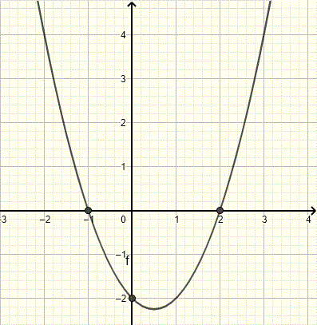

Using basic calculus, lets calculate the derivative of our MSE cost function:

	Derivative of (actual value - desired value)²:
	2 x (actual value - desired value)

	Same math as:
	Derivative of x² = 2x

Easy! Now for the hard part. We can’t just back propagate layer by layer, with each layer in its own vacuum. The point of backpropagation is to correct the model in terms of the inputs, so we can't just only look at each layer by itself. We need some way to calculate cost in terms of the earlier layers.

The sigmoid function is nice since it keeps our activations between 0 and 1, but it has slightly “corrupted” our values at this point. In order to adjust stuff while backpropagating to translate back to what it was before sigmoid affected it, 

The basic calculation we make during backpropagation is, “how sensitive is the final cost function in terms of all the weights and biases in the entire network?”. This basically means that, if we calculate that changing a certain weight will vastly decrease the cost of our final output, we should change that weight a lot. If changing a weight will only give a marginal drop in the final cost, we should only nudge that a little.

Another way to say this, is what is the derivative of the cost (how much it will change) with respect to the weight or bias we are looking at and thinking about nudging. 

This is where the chain rule comes in. Imagine the chain rule as a way to calculate a final derivative by working backward step by step. For example, if you know that a car goes 2 times faster than a bike, and a bike goes 4 times faster than a person, you can’t directly calculate how much faster a car goes than a person. But, you can use the intermediate value of the bike to calculate that a car goes 8 times faster than a person.

Another way of saying this, is “how fast is a car going in terms of the world of human speed?”.

So the only information we have is the derivative of the cost, but we then have to calculate that in terms of the world of whatever weight or bias we want to change. So, our “bikes” in this case which separate our weight and our final cost are the activation we multiplied the weight by, the sigmoid function we passed through, and we already have the derivative for the part where we subtracted the desired value and squared our function.

To get back in the world of the weight we want to adjust, we multiply by this function:

(derivative of (actual value - desired value)²) x (derivative of σ(actual value)) x (derivative of weight x previous activation)

or:

(2 x (actual value - desired value)) x (derivative of σ(actual value)) x (derivative of weight x previous activation)

So the derivative of MSE connects our cost to our actual value.
The derivative of the sigmoid connects the sigmoided actual value to our value with no sigmoid.
The derivative of weight x previous activation connects our value with no sigmoid to our weight.

derivative of weight x previous activation -> this equation will always just be equal to the previous activation, because we are taking the derivative in terms of the weight. Imagine this equation being 2x, where x is the weight and 2 is the previous activation. The derivative of 2x is simply 2.

Here is an even more simplified version of the equation:

	The derivative of sigmoid is always equal to a x (1 - a)

	(2 x (actual value - desired value)) x (actual value x (1 - actual value) x (previous activation)

To calculate in terms of bias instead of weight just do:

	(2 x (actual value - desired value)) x (actual value x (1 - actual value) x (1)

This is because the derivative of addition is always just 1.

	Delta = (2 x (actual value - desired value)) x (actual value x (1 - actual value)

We don’t have to go quite as far back as the weight for delta, only back to the activation. Note that this is an equal calculation for the bias.

